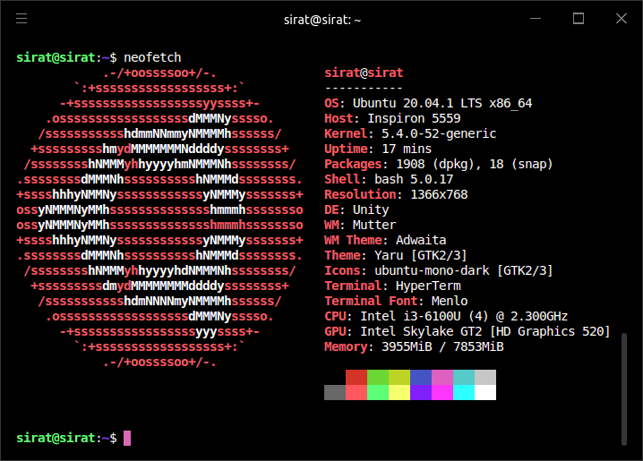

# dotfiles

```text
 ______________
|^|          | | i love my computer. i really do.
| |__________| | it sucks but i still give it my
|  __________| | everything. my everything is still
| |          | | not enough though. i hope debian
| |          | | fills up that void because i am
| |__________| | DONE with ubuntu. it's been 1 to
|_|__________|_| 2 years anyway.
```

## some cool commands

```bash
neofetch
```


